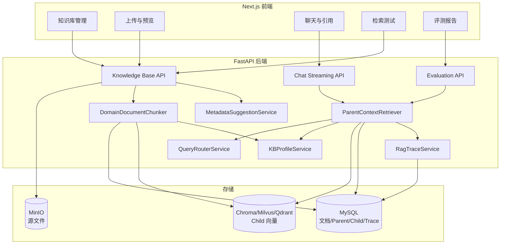
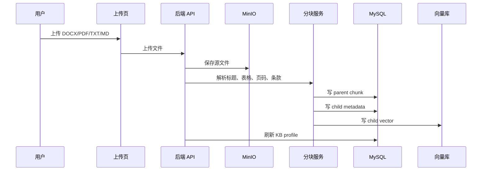
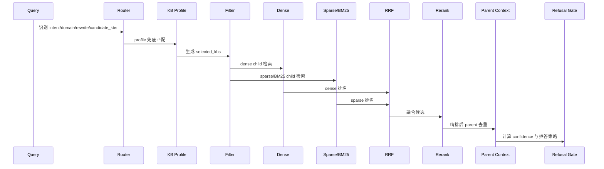
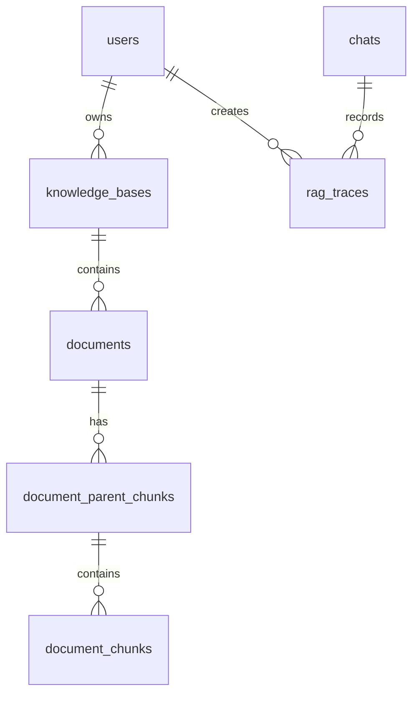

# 架构设计

本系统围绕医院后勤与医工资料的“入库、检索、生成、评测、追溯”设计。核心原则是：检索链路必须可解释，生成答案必须有证据，缺少证据时必须拒答。

## 总体架构

## 入库链路

### 为什么这样设计

| 设计 | 原因 |
| --- | --- |
| 源文件保存到 MinIO | 支持重试、重建索引、审计和后续解析优化 |
| parent/child 两层 chunk | child 适合召回，parent 适合生成和引用 |
| 标题、表格、条款边界保护 | 医院流程和制度文档不能被机械切断 |
| metadata 建议与确认 | department、doc_type、effective_date 会影响权限和过滤 |
| MySQL + 向量库双写 | MySQL 保存可审计上下文，向量库负责召回效率 |

## 检索链路

### 模块取舍

| 模块 | 选择原因 | 替代方案问题 |
| --- | --- | --- |
| Query Router | 多知识库下先收窄候选，降低噪声召回 | 全库检索容易把通用维修资料排到前面 |
| KB Profile | Router 失败时仍可用关键词和摘要兜底 | 完全依赖 LLM 路由会降低稳定性 |
| Dense + Sparse/BM25 | 兼顾语义召回与专有词、编号召回 | 单纯 dense 对短词、设备型号不稳定 |
| RRF | 不要求不同检索器分数可比 | 直接分数加权对模型和向量库敏感 |
| Rerank | 提升 TopK 排序质量 | 全量 rerank 成本和延迟不可控 |
| Parent 去重 | 避免多个 child 重复占用上下文 | 直接塞 child 会导致答案缺上下文或重复 |
| 拒答门禁 | 在生成前拦截无证据问题 | 只靠 prompt 约束无法稳定拒答 |
| Trace 落库 | 支持问题复盘、质量分析和审计 | 只保存最终答案无法解释错误来源 |

## 数据模型

关键表：

| 表 | 作用 |
| --- | --- |
| `documents` | 源文档 metadata、部门、文档类型、设备型号、有效期 |
| `document_parent_chunks` | 生成上下文和引用证据 |
| `document_chunks` | 检索单元，保存 parent_id 与 scalar filter 字段 |
| `knowledge_bases` | KB profile、关键词、文档数量 |
| `rag_traces` | query、路由、候选、latency、confidence、拒答原因 |

数据库变更同时提供 Alembic migration 与 SQL 文件，分别位于 `backend/alembic/versions` 和 `backend/database`。

## 主要代码位置

| 文件 | 职责 |
| --- | --- |
| `backend/app/services/document_chunker.py` | 领域分块、parent/child 生成、章节路径保留 |
| `backend/app/services/metadata_service.py` | metadata 建议与确认合并 |
| `backend/app/services/query_router_service.py` | 结构化路由与启发式 fallback |
| `backend/app/services/kb_profile_service.py` | KB profile 构建与匹配 |
| `backend/app/services/retrieval_service.py` | 检索主链路、RRF、rerank、拒答 |
| `backend/app/services/vector_store/milvus.py` | Milvus dense/sparse/BM25/filter 适配 |
| `backend/app/services/evaluation_service.py` | ablation 评测 |
| `frontend/src/components/retrieval/retrieval-trace-panel.tsx` | 检索链路可视化 |

## 降级策略

- Milvus sparse/BM25 不可用时，回退到 SQL lexical search。
- Router 可关闭，关闭后使用用户选择的知识库范围。
- Metadata LLM 可关闭，关闭后使用启发式建议。
- Rerank 可关闭，保留 dense/hybrid 检索。
- 拒答阈值可配置，trace 中记录拒答原因。
