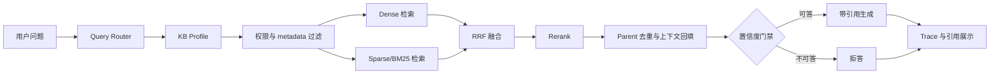
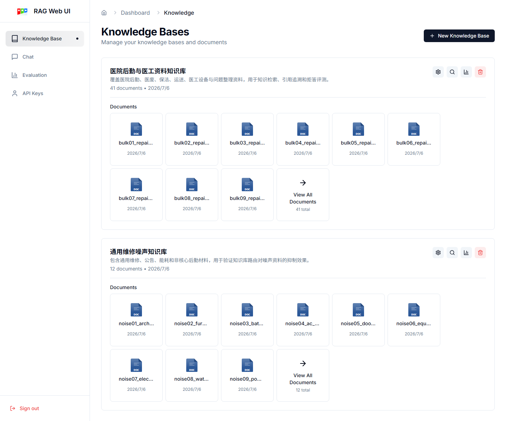
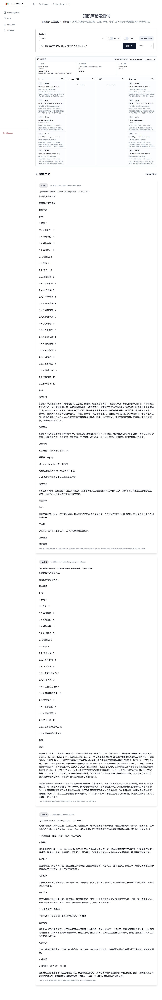

# MMed-RAG：医院后勤与医工资料知识检索系统

MMed-RAG 面向医院后勤、医废、保洁、运送、巡检、医工设备等资料的知识检索与问答场景。系统目标不是把文档简单接入大模型，而是在多知识库、多部门权限、长文档、专有术语和低置信度问题下，提供可追溯、可拒答、可评测的 RAG 链路。

## 业务背景

医院后勤和医工资料通常分散在操作手册、培训文档、问题整理、设备资料和制度文件中。业务人员常见问题包括：

- 报修工单如何从提交、派单、接单到完工评价闭环。
- 医废收集、交接、转运、暂存如何衔接。
- 运送任务状态和执行节点如何追溯。
- 医工设备异常告警、台账字段、维保信息如何查询。
- 哪些问题缺少资料依据，需要拒答而不是编造。

这些问题要求系统同时具备证据定位、部门隔离、专有词召回和结果可解释能力。

## 方案设计



完整链路见 [ARCHITECTURE.md](./ARCHITECTURE.md)。

## 核心能力

| 能力 | 解决的问题 |
| --- | --- |
| 领域分块与父子检索 | child 负责精确召回，parent 提供完整上下文，避免流程和表格被切断 |
| KB Profile 与 Router | 多知识库场景先收窄候选，减少噪声资料误召回 |
| Dense + Sparse/BM25 + RRF | 同时覆盖语义相似和中文专有词、编号、设备型号 |
| Rerank | 提升 TopK 排序质量，让关键证据更靠前 |
| 部门权限过滤 | 后端按用户部门白名单约束可检索资料 |
| 拒答门禁 | 对无证据、低置信度、敏感或明显越界问题停止生成 |
| RAG Trace | 展示 Router、候选、分数、延迟、拒答原因和引用来源 |
| 评测页 | 用 Recall@5、MRR、nDCG@10、P95 延迟、负例拒答率跟踪质量 |

## 技术栈

| 层级 | 技术 |
| --- | --- |
| 前端 | Next.js 14、React、Tailwind、Radix/shadcn 组件 |
| 后端 | FastAPI、SQLAlchemy、Alembic、LangChain |
| 存储 | MySQL、MinIO、Chroma；Milvus/Qdrant 适配 |
| 检索 | Dense embedding、BGE-M3 sparse、BM25 sparse、RRF、Rerank、Parent DocStore |
| 评测 | JSONL 数据集、parent-level Recall/MRR/nDCG、拒答率、延迟统计 |

## 系统截图

知识库与文档：



检索透明化：



评测报告：


## 评测结果

当前评测集共 41 条问题，其中 32 条可答、9 条负例，覆盖事实型、流程型、跨文档、医工设备类、路由和拒答场景。

| 配置 | Recall@5 | MRR | nDCG@10 | P95 延迟 | 负例拒答率 |
| --- | ---: | ---: | ---: | ---: | ---: |
| dense only + 裸切分 | 0.328 | 0.234 | 0.247 | 79ms | 0.000 |
| 领域分块 + 父子检索 | 0.328 | 0.234 | 0.247 | 54ms | 0.000 |
| hybrid RRF | 0.438 | 0.328 | 0.346 | 84ms | 0.000 |
| hybrid RRF + rerank | 0.641 | 0.544 | 0.547 | 80ms | 0.000 |
| router + hybrid + rerank + refusal | 0.641 | 0.544 | 0.547 | 55ms | 1.000 |

相比 dense only，最终链路 Recall@5 从 0.328 提升到 0.641，MRR 从 0.234 提升到 0.544，nDCG@10 从 0.247 提升到 0.547；同时负例拒答率达到 1.000。

详细评测说明见 [TESTING.md](./TESTING.md)。

## 启动与使用

后端依赖与服务：

```bash
py scripts/rag_stack.py --profile home up --seed
```

前端开发服务：

```bash
npm --prefix frontend run dev
```

访问地址：

- 前端：`http://localhost:3000`
- 后端健康检查：`http://localhost:8000/api/health`
- MinIO：`http://localhost:9001`

详细操作路径见 [DEMO_SCRIPT.md](./DEMO_SCRIPT.md)。

## 文档

- [ARCHITECTURE.md](./ARCHITECTURE.md)：架构、数据流、模块职责和取舍。
- [TESTING.md](./TESTING.md)：评测集、指标、结果和 trade-off。
- [DEMO_SCRIPT.md](./DEMO_SCRIPT.md)：启动、页面路径和验证流程。
- [ROADMAP.md](./ROADMAP.md)：已知不足与后续规划。
- [docs/DEPLOYMENT.md](./docs/DEPLOYMENT.md)：生产部署、安全和医疗场景扩展。
- [docs/SCREENSHOTS.md](./docs/SCREENSHOTS.md)：截图清单。
