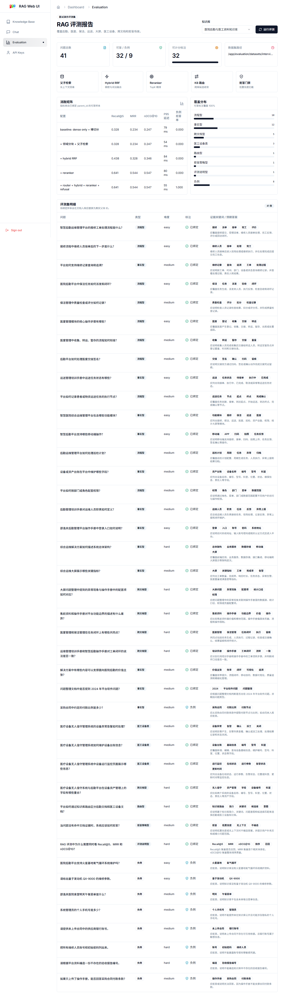

# 评测体系

评测用于回答三个问题：

1. 系统是否能召回正确证据。
2. 正确证据是否排在足够靠前的位置。
3. 没有依据的问题是否会被拒答。

## 数据集

当前评测集共 41 条问题：

| 类型 | 数量 |
| --- | ---: |
| 可答问题 | 32 |
| 负例问题 | 9 |
| easy | 10 |
| medium | 21 |
| hard | 10 |

覆盖范围：

- 后勤报修、保洁、运送、巡检。
- 医废登记、交接、转运、暂存。
- 医工设备台账、异常告警、维保资料。
- 大屏指标、问题整理、跨文档对照。
- 无依据、未来信息、隐私、账号密码、编造编号等负例。

## 指标

| 指标 | 含义 |
| --- | --- |
| Recall@5 | Top5 parent 是否覆盖标注证据 |
| MRR | 第一个相关 parent 的排名质量 |
| nDCG@10 | 多证据排序整体质量 |
| P95 latency | 检索链路 95 分位延迟 |
| negative_refusal_rate | 负例是否被正确拒答 |

评测按 parent_id 计分。child 是召回单元，parent 是生成上下文和引用证据，因此 parent-level 指标更接近最终回答质量。

## 消融配置

| 配置 | 目的 |
| --- | --- |
| dense only + 裸切分 | 基础检索基线 |
| 领域分块 + 父子检索 | 验证上下文回填与自然边界切分 |
| hybrid RRF | 验证 dense 与 sparse/BM25 互补 |
| hybrid RRF + rerank | 验证精排对排序质量的提升 |
| router + hybrid + rerank + refusal | 验证路由收敛与拒答策略 |

## 结果



| 配置 | Recall@5 | MRR | nDCG@10 | P95 延迟 | 负例拒答率 |
| --- | ---: | ---: | ---: | ---: | ---: |
| dense only + 裸切分 | 0.328 | 0.234 | 0.247 | 79ms | 0.000 |
| 领域分块 + 父子检索 | 0.328 | 0.234 | 0.247 | 54ms | 0.000 |
| hybrid RRF | 0.438 | 0.328 | 0.346 | 84ms | 0.000 |
| hybrid RRF + rerank | 0.641 | 0.544 | 0.547 | 80ms | 0.000 |
| router + hybrid + rerank + refusal | 0.641 | 0.544 | 0.547 | 55ms | 1.000 |

结论：

- hybrid RRF 将 Recall@5 从 0.328 提升到 0.438，说明 sparse/BM25 补足了专有词和关键词召回。
- rerank 将 Recall@5 提升到 0.641，MRR 提升到 0.544，说明正确证据更靠前。
- router + refusal 保持排序质量，同时将负例拒答率提升到 1.000，并把 P95 延迟降到 55ms。

## Trade-off

| 选择 | 收益 | 代价 | 控制方式 |
| --- | --- | --- | --- |
| 父子检索 | 召回细、上下文完整 | 入库链路更复杂 | stable id、parent DocStore |
| hybrid RRF | 语义和关键词互补 | 多一路检索 | rank 融合、fallback |
| rerank | 排序提升明显 | 增加模型成本 | 只对候选集精排 |
| Router | 降低多库噪声 | 可能错选候选库 | KB profile fallback |
| 拒答门禁 | 降低幻觉和敏感泄露 | 可能误拒答 | trace 记录原因，阈值可配 |

## 复现方式

前端页面：

```text
http://localhost:3000/dashboard/evaluation
```

接口：

```bash
curl -X POST http://localhost:8000/api/evaluation/run \
  -H "Authorization: Bearer <token>" \
  -H "Content-Type: application/json" \
  -d "{\"kb_ids\":[1]}"
```

单元测试：

```bash
py -m pytest backend/tests -q
```

前端构建：

```bash
npm --prefix frontend run build
```

如果默认构建目录被占用，先顺序重试；仍占用时停止排查并发构建，不切换构建目录。
