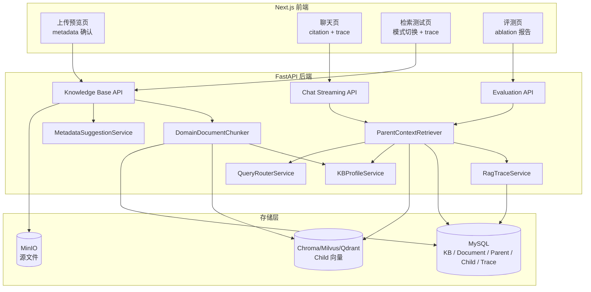
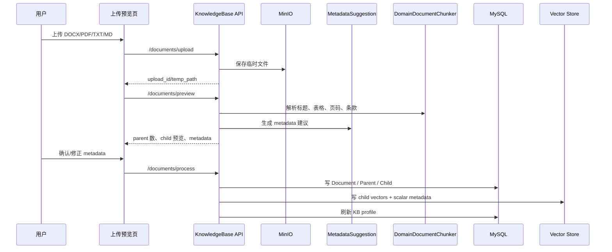
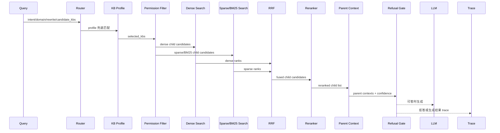
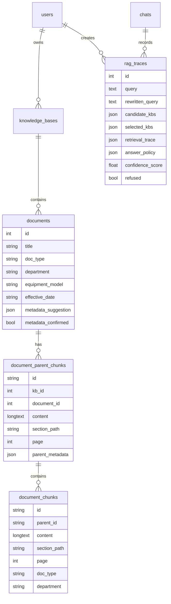

# 架构设计

目标是一页纸讲清楚：文档如何入库、问题如何检索、为什么这样拆模块，以及这些选择解决了 naive RAG 的什么问题。

## 总体架构

## 文件上传链路

为什么这样选：

| 模块 | 选择 | 不直接选 naive 方案的原因 |
| --- | --- | --- |
| MinIO 保存源文件 | 源文件与解析结果分离 | 上传失败、重试、审计、重新切分都需要可复用源文件 |
| metadata 建议 + 人工确认 | LLM/启发式建议只作为草稿 | 医院资料的部门、文档类型、设备型号影响权限与过滤，不能完全相信自动抽取 |
| parent/child 两层 chunk | child 入向量库，parent 入 MySQL DocStore | child 适合召回，parent 适合生成；单层 chunk 要么太短丢上下文，要么太长召回差 |
| 表格/标题/条款保护 | 按业务边界切分 | 固定字符切分容易把流程步骤、表格行列、制度条款切断 |
| scalar metadata 同步到 MySQL 与向量库 | 支持检索过滤与页面展示 | 只把 metadata 存 JSON 里，后续权限过滤、页面引用和 Milvus filter 都难稳定 |

## 检索链路

关键取舍：

| 模块 | 为什么选这个 | 不选什么 |
| --- | --- | --- |
| 结构化 Router | 多知识库时先缩小候选，减少噪声库误召回；输出 intent/domain/rewrite 便于 trace | 不直接全库 TopK，因为问题越短越容易被通用维修资料污染 |
| KB profile | 以知识库简介、文档标题、抽样 parent 内容生成轻量画像，LLM Router 失败时可 deterministic fallback | 不把每个 query 都强依赖 LLM 路由，避免外部模型不可用导致主链路不可用 |
| Dense + sparse/BM25 | dense 解决语义，sparse/BM25 解决专有词、编号、设备型号、中文关键词 | 不只用 dense；“医废交接签名”“QX-9000”这类词对 embedding 不稳定 |
| RRF | 不要求 dense/sparse 分数同分布，只使用排名融合，工程上更稳 | 不直接加权分数，因为不同向量库、metric、BM25 分数不可比 |
| Reranker | 对 TopK 候选做精排，提高首个相关 parent 排名 | 不全量 rerank，成本高且延迟不可控 |
| Parent 去重 | 多个 child 命中同一 parent 时只回填一次 | 不把多个 child 原样塞给 LLM，避免上下文重复挤占 token |
| 拒答门禁 | 置信度、query support、显式敏感/不存在触发器共同判断 | 不让 LLM 自行决定是否拒答，因为它无法可靠知道检索证据是否充分 |
| 自建 trace | 保存 router、候选、latency、confidence、answer_policy | 不只看最终答案；面试和生产都需要解释“为什么这么答” |

## 数据模型

数据库变更同时提供 Alembic 和 SQL：

- [backend/alembic/versions/20260705_rag_demo_schema.py](./backend/alembic/versions/20260705_rag_demo_schema.py)
- [backend/alembic/versions/20260705_second_rag_demo_schema.py](./backend/alembic/versions/20260705_second_rag_demo_schema.py)
- [backend/database/20260705_rag_demo_schema.sql](./backend/database/20260705_rag_demo_schema.sql)
- [backend/database/20260705_second_rag_demo_schema.sql](./backend/database/20260705_second_rag_demo_schema.sql)

## 主要模块

| 文件 | 职责 | 面试时要讲清楚的点 |
| --- | --- | --- |
| [backend/app/services/document_chunker.py](./backend/app/services/document_chunker.py) | DOCX/PDF 解析、parent/child 切分、章节路径 | 大文档不能只调 chunk size，必须尊重标题、表格、条款边界 |
| [backend/app/services/metadata_service.py](./backend/app/services/metadata_service.py) | metadata 建议与人工确认合并 | metadata 是权限、过滤、路由和引用的共同基础 |
| [backend/app/services/query_router_service.py](./backend/app/services/query_router_service.py) | Router 与 fallback | Router 是为了降低噪声，不是为了炫技调用 LLM |
| [backend/app/services/kb_profile_service.py](./backend/app/services/kb_profile_service.py) | 构建/匹配知识库画像 | profile 让路由在本地也可解释、可降级 |
| [backend/app/services/retrieval_service.py](./backend/app/services/retrieval_service.py) | dense/sparse/RRF/rerank/parent/refusal 主链路 | 检索结果、置信度和拒答在这里闭环 |
| [backend/app/services/vector_store/milvus.py](./backend/app/services/vector_store/milvus.py) | Milvus dense/sparse/BM25/filter 适配 | sparse 字段、BM25 analyzer、fallback 是生产化信号 |
| [backend/app/services/evaluation_service.py](./backend/app/services/evaluation_service.py) | JSONL 评测与 ablation | 用 parent-level 指标证明每个增强点的收益 |
| [frontend/src/components/retrieval/retrieval-trace-panel.tsx](./frontend/src/components/retrieval/retrieval-trace-panel.tsx) | 前端 trace 可视化 | 让面试官看到 Router、候选、延迟、拒答原因 |

## 边界与降级

- Milvus sparse/BM25 依赖版本或 extras 不可用时，后端会 fallback 到 SQL lexical search，保证演示不中断。
- KB Router 可关闭；关闭时检索退回传入 KB 列表。
- Metadata LLM 抽取可关闭；关闭时使用启发式建议。
- Reranker 可关闭；关闭时仍可演示 dense/hybrid/RRF。
- 拒答阈值可配置，避免把策略写死在 UI。

## 面试总结

这套架构的核心不是“多加几个组件”，而是把每个增强点挂到真实问题上：大文档需要 parent/child，中文专有词需要 sparse/BM25，多知识库需要 Router，医疗场景需要权限与拒答，面试和生产都需要 trace 与评测。
