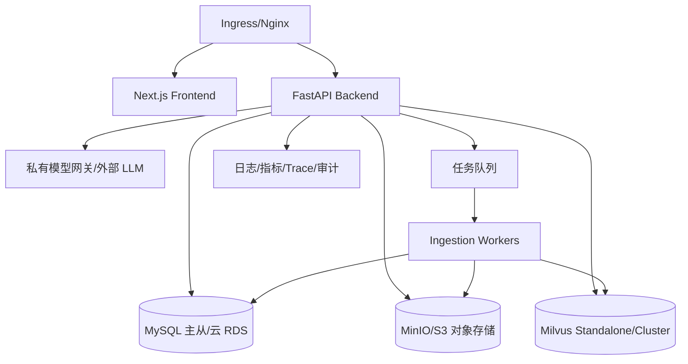

# 生产部署思路

这不是当前 Demo 已全部完成的生产方案，而是把现有架构平滑推到生产时的落地路径。

## 标准部署

推荐拆分：

- 前端：Next.js 静态/Node 服务，走统一网关。
- 后端：FastAPI 多副本，无状态化；上传、检索、评测、聊天接口分开限流。
- 文档处理：从当前 background task 升级为队列 worker，支持失败重试、取消、进度、并发控制。
- 数据库：MySQL 存业务元数据、parent DocStore、trace、权限。
- 向量库：Milvus 集群或托管向量库；保留 Chroma 作为本地开发。
- 对象存储：MinIO/S3 保存源文件和中间产物。
- 模型调用：统一模型网关，做鉴权、限流、审计、脱敏、成本统计。

## 敏感数据处理

- 源文件落对象存储，按知识库/部门隔离 bucket prefix。
- 文档 metadata 标注部门、文档类型、有效期、设备型号、密级。
- 入库前做敏感词/PII 扫描：手机号、身份证、账号密码、银行账号、供应商敏感信息。
- 对 trace 做脱敏策略，避免把完整上下文、敏感 query 无限制暴露给普通管理员。
- 对导出的评测报告和截图做二次检查，面试材料不包含真实患者、员工隐私和凭据。

## 权限控制

现有 demo 已有 `allowed_departments` 和后端检索过滤。生产建议扩展为：

- 用户维度：院区、部门、角色、岗位、是否超管。
- 文档维度：department、doc_type、effective_date、密级、适用院区。
- 检索维度：所有 filter 在后端生成，不信任前端传入。
- Trace 维度：普通用户只能看自己的 trace，管理员按权限看部门 trace。
- 操作维度：上传、删除、确认 metadata、刷新 profile、运行评测分权限。

## AI 调用安全

- LLM 调用前：拒答门禁、权限过滤、上下文裁剪、敏感信息脱敏。
- LLM 调用中：系统 prompt 强制只基于 Context 回答，每个事实句必须 citation。
- LLM 调用后：检查 citation 覆盖率、拒绝无引用事实句、记录 answer_policy。
- 模型网关：统一超时、重试、熔断、限流、成本统计。
- 高风险问题：隐私、凭据、采购合同、医疗建议、未上传资料，走更严格拒答或人工确认。

## 医疗场景扩展

- 医工：设备型号、序列号、维保周期、合同、配件、故障码。
- 后勤：报修、保洁、运送、医废、巡检、能耗、食堂、满意度。
- 多院区：院区、楼宇、科室、点位作为 metadata filter。
- 版本管理：制度/手册按 effective_date 和版本号生效，过期资料降低排序或提示过期。
- 审计：保留 query、selected_kbs、引用 parent、拒答原因和模型版本，支持事后追责。

## 上线检查清单

- 数据库 migration 与 SQL 文件同时存在。
- 向量集合 schema 固定，dense/sparse/BM25 字段明确。
- 文档处理任务可重试、可观察、可停止。
- 权限过滤有单元测试和接口测试。
- 评测集覆盖正例、负例、跨文档、路由、权限。
- 所有模型调用有超时、失败降级和审计日志。
- 截图和 Demo 数据经过脱敏。
