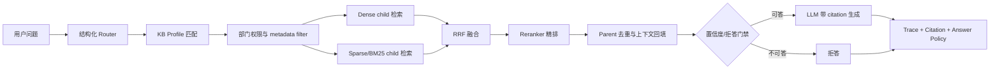

# MMed-RAG：面向医院后勤与医工资料的可追溯 RAG Demo

这个项目不是一个“上传文档然后问答”的套壳 RAG，而是把医院后勤、医废、保洁、运送、医工设备资料放到一个真实业务语境里，围绕大文档、多部门、多知识库、专有词、拒答和可追溯几个问题做增强。

核心场景可以理解为：医院后勤或医工人员需要在操作手册、培训资料、问题整理、设备资料之间快速查到“某个流程怎么走、某个字段在哪维护、某类异常怎么闭环”。这些问题看似是问答，实际有三个约束：

1. 答案必须来自已上传资料，不能用模型常识补。
2. 引用要能定位到 parent/child、页码、章节路径，方便追责和复核。
3. 不同部门、不同知识库不能混检出越权或无关材料。

## 为什么 naive RAG 不够

朴素 RAG 通常是固定 chunk size 切分、dense embedding 召回 TopK、把文本塞给 LLM。这条链路在本场景里会暴露几个问题：

| 真实问题 | naive RAG 的表现 | 本项目的处理 |
| --- | --- | --- |
| DOCX/PDF 长文档里表格、条款、流程节点容易被切断 | chunk 命中但上下文不完整，答案漏步骤 | 领域分块 + parent/child 检索：child 负责召回，parent 回填生成上下文 |
| “医废交接签名”“无人值守告警”“QX-9000”等专有词对 dense 不稳定 | 语义相近但业务不相关的内容被召回 | dense + sparse/BM25 + RRF，Milvus 适配 BGE-M3 learned sparse 与 jieba analyzer |
| 多知识库演示时，全库检索容易被噪声库污染 | 召回结果来自错误资料 | 结构化 Router + KB profile 先缩小候选知识库 |
| 医院数据按部门隔离 | 模型可能看到无权限资料 | 后端部门权限过滤下推到检索 filters |
| 库里没有答案时，模型仍可能编答案 | 面试演示和生产都很危险 | 置信度阈值、query support、显式拒答触发器、自建 RAG trace |
| 面试时很难证明链路有效 | 只能展示最终答案 | 检索透明化面板、引用弹层、评测页、ablation 指标 |

## 方案概览

更完整的一页纸方案见 [ARCHITECTURE.md](./ARCHITECTURE.md)，其中包含文件上传链路、检索链路、模块划分和关键技术取舍。

## 核心功能

- 文档入库：支持 DOCX/PDF/TXT/MD 上传、预览、metadata 建议与人工确认。
- 领域分块：保留 Word 标题层级、条款边界、表格结构、PDF 页码，生成 parent/child 两层 chunk。
- 检索增强：支持 dense、hybrid RRF、Milvus BGE-M3 sparse、Milvus BM25 sparse、reranker。
- KB 路由：结构化 Router 判断意图、领域、改写 query、候选 KB；KB profile 提供 deterministic fallback。
- 权限过滤：按用户 allowed_departments 生成后端检索过滤条件。
- 可追溯回答：Chat 流式首包携带 `context + trace + answer_policy` envelope，旧 `__LLM_RESPONSE__` 兼容保留。
- 检索透明化：聊天页与检索测试页展示 Router、候选 KB、dense/sparse/RRF/rerank、latency、confidence、拒答原因。
- 量化评测：评测页支持 ablation，指标包括 Recall@5、MRR、nDCG@10、P95 latency、负例拒答率。

## 技术栈

| 层 | 技术 |
| --- | --- |
| 后端 | FastAPI、SQLAlchemy、Alembic、LangChain |
| 前端 | Next.js 14、React、Tailwind、shadcn/radix 组件、lucide-react |
| 存储 | MySQL、MinIO、Chroma；Milvus/Qdrant 适配保留 |
| 检索 | dense embedding、BGE-M3 sparse、BM25 sparse、RRF、rerank、parent/child DocStore |
| 评测 | JSONL 数据集、parent-level Recall/MRR/nDCG、拒答率、latency |
| 部署 | Docker Compose、本地 home/office profile、`scripts/rag_stack.py` |

## 当前效果

当前面试评测集位于 [backend/evaluation/datasets/interview_demo.jsonl](./backend/evaluation/datasets/interview_demo.jsonl)，共 41 条问题，覆盖后勤、医废、保洁、运送、大屏、医工设备、跨文档、路由与拒答。

已有评测截图：

截图中的一次评测结果：

| 配置 | Recall@5 | MRR | nDCG@10 | P95 延迟 | 负例拒答率 |
| --- | ---: | ---: | ---: | ---: | ---: |
| baseline: dense only + 裸切分 | 0.328 | 0.234 | 0.247 | 79ms | 0.000 |
| + 领域分块 + 父子检索 | 0.328 | 0.234 | 0.247 | 54ms | 0.000 |
| + hybrid RRF | 0.438 | 0.328 | 0.346 | 84ms | 0.000 |
| + reranker | 0.641 | 0.544 | 0.547 | 80ms | 0.000 |
| + router + hybrid + reranker + refusal | 0.641 | 0.544 | 0.547 | 55ms | 1.000 |

这组数据说明两件事：hybrid/RRF/rerank 提升了可答问题的排序质量，router/refusal 在保持检索质量的同时，把负例拒答率从 0 提升到 1.000，并降低了最终链路 P95 延迟。

## 演示路径

完整脚本见 [DEMO_SCRIPT.md](./DEMO_SCRIPT.md)。推荐演示顺序：

1. 打开知识库，展示医院后勤/医工资料不是通用 FAQ。
2. 上传 DOCX/PDF，展示 metadata 建议、parent/child 数量和 chunk 预览。
3. 在检索测试页切换 dense/hybrid、rerank、KB Route，展示 trace 面板。
4. 在聊天页问一个可答流程问题，展开引用弹层和 trace。
5. 问一个负例问题，例如“请给出量子发动机 QX-9000 的维修参数”，展示拒答。
6. 打开评测页，讲 ablation 表格和拒答率。

## 项目文档

- [ARCHITECTURE.md](./ARCHITECTURE.md)：一页纸架构、模块划分、上传/检索数据流与取舍。
- [TESTING.md](./TESTING.md)：评测集、指标、ablation 结果与 trade-off。
- [DEMO_SCRIPT.md](./DEMO_SCRIPT.md)：启动命令、演示路径、截图清单。
- [docs/INTERVIEW_STORIES.md](./docs/INTERVIEW_STORIES.md)：2-3 个面试可讲的难点故事。
- [docs/DEPLOYMENT.md](./docs/DEPLOYMENT.md)：生产部署、敏感数据、权限、AI 调用安全、医疗场景扩展。
- [ROADMAP.md](./ROADMAP.md)：主动暴露不足与可控优化方向。
- [docs/SCREENSHOTS.md](./docs/SCREENSHOTS.md)：截图清单与当前素材状态。

## 可优化方向

- 将评测集从演示样本扩展为持续回归集，覆盖更多院区、科室、设备型号和版本资料。
- 将拒答从规则/阈值增强为可配置策略，并按业务风险分级。
- 对 parent/child、RRF 常数、reranker TopN 做自动化调参。
- 引入 OCR、版面解析和表格结构化，提升扫描件、复杂表格和附件包处理能力。
- 将 trace 落库接入审计后台，支持问题复盘、知识库补齐和人工反馈闭环。

## 简历/口头一句话

我把一个基础 RAG Demo 改造成医院后勤/医工场景的可追溯检索系统：通过结构化 Router、KB profile、父子检索、hybrid RRF、rerank 和拒答门禁，把 41 条业务评测集上的最终链路做到 Recall@5 0.641、MRR 0.544、nDCG@10 0.547、负例拒答率 1.000，并提供 trace 面板解释每次回答的证据来源。
